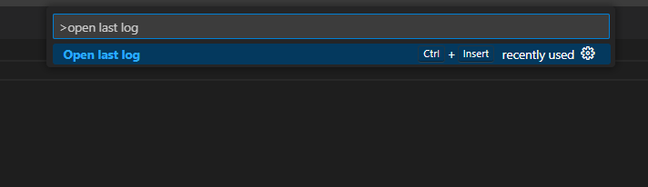
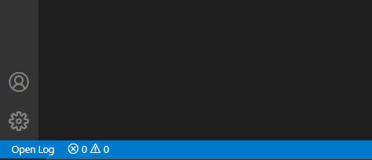

<div style="max-width: 1920px;">

# Last Log

<p style="text-align: center;">
  
</p>

## Features

Last Log offers a convenient way to view the most recent file inside a folder of your choice.
It is possible to use the extension in 3 ways: from the button on the left side of the status bar, from the command line with the command "Open last log", or by creating a custom key binding.

<div style="text-align: center;">



</div>
<div style="text-align: center;">



</div>

## Settings

This extension contributes the following settings:

* `lastLog.folderPath`: Specifies the folder path containing the log files. Default value is **'logs'** which represents: **\\workspace-folder\\logs**. To navigate back outside the workspace add ..\\ for each folder.
* `lastLog.includeSubfolders`: Specifies if the logs located in subfolders are to be considered (any depth level). Default true.
* `lastLog.fileExtension`: The file extension of the log files. If unset or set to '*' it will work on any file type. Default is 'log'.
* `lastLog.excludeFolders`: Specifies a list of folders to be ignored (it only has effect when includeSubfolders is set to true).
* `lastLog.logRetentionTime`: Sets the maximum age (in minutes) of log files in the workspace. Files older than this limit will be deleted. This action will trigger when opening a log file. If unset or set to 0 this functionality will be disabled, and no log files will be deleted from the folder. Default 0.
* `lastLog.deleteExcludedFolders`: If set to true, the files located inside excluded folders will be deleted according to the logRetentionTime setting. This action will trigger when opening a log file. If unset or set to false, the excluded folders will be ignored and not deleted. Default false.
* `lastLog.deleteEmptyFolders`: If set to true, any empty subfolder will be removed. This action will trigger when opening a log file. If unset or set to false, empty folders will be ignored and not deleted. Default false.

### Example configuration:

```js
{
	"lastLog.folderPath": "myLogsFolder",
	"lastLog.includeSubfolders": true,
	"lastLog.fileExtension": "txt",
	"lastLog.excludeFolders": [
		"nameFolder1", "nameFolder2"
	],
	"lastLog.logRetentionTime": 60,
	"lastLog.deleteExcludedFolders": true,
	"lastLog.deleteEmptyFolders": true
}
```

**Enjoy!**

</div>